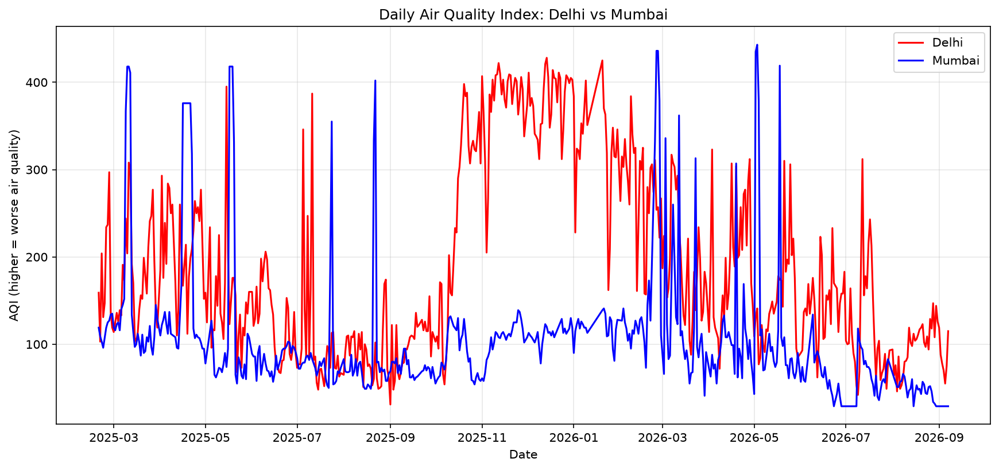
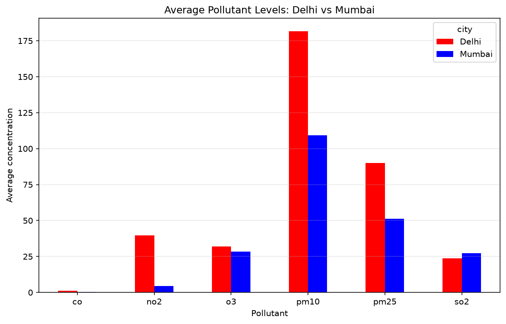

# 🌫️ India Air Quality Analytics Pipeline

An end-to-end data engineering and analytics project that pulls real-time air quality sensor data from the OpenAQ API for Delhi and Mumbai, cleans it using domain-informed rules, calculates official India AQI scores, and visualizes pollution trends across both cities.


---

## 📌 Overview

This project builds a complete pipeline — from raw API data to a finished analysis — covering:

- **Data acquisition** from a live government-backed air quality API (OpenAQ)
- **Data cleaning** using India's official CPCB pollution severity standards, not blind statistical assumptions
- **AQI calculation** using CPCB's real published sub-index formula
- **Visualization** of daily trends, pollutant breakdowns, and dominant-pollutant analysis

Built to practice real-world data analyst skills: working with unreliable third-party APIs, handling missing/inconsistent data, and applying domain knowledge to clean data correctly.

## 🗺️ Cities Covered

| City | Why |
|------|-----|
| **Delhi** | Consistently among the world's most polluted major cities |
| **Mumbai** | Coastal city, generally better air quality — a useful contrast |

## ⚙️ Tech Stack

- **Python** — core scripting
- **Requests** — API calls to OpenAQ
- **Pandas** — data cleaning, reshaping, aggregation
- **Matplotlib** — data visualization
- **python-dotenv** — secure API key management

## 📁 Project Structure


aqi-pipeline/
├── fetch_data.py # Pulls raw data from OpenAQ API
├── clean_data.py # Removes physically impossible sensor readings
├── calculate_aqi.py # Converts pollutant values into official AQI scores
├── visualize.py # Generates all charts
├── data/ # Raw, cleaned, and processed CSVs + chart images
├── .env # API key (not tracked in git)
└── requirements.txt


## 📊 Sample Output





## 🧠 Key Design Decisions

- **Chunked API requests** — pulling a full year of data in one request timed out; data is fetched in ~2-month chunks and combined.
- **Domain-informed outlier handling** — instead of blindly removing statistical outliers, readings were checked against CPCB's official "Severe" pollution thresholds. Most flagged outliers turned out to be real, extreme pollution days, not sensor errors — only physically impossible values were removed.
- **Official AQI formula** — AQI is calculated using CPCB's real linear sub-index interpolation, using the *worst* pollutant sub-index per day (the "dominant pollutant"), matching how India's official AQI is actually reported.

## 🚀 How to Run

```bash
# 1. Clone the repo
git clone https://github.com/MehulVi/AQI-Pipeline-using-Python-.git
cd AQI-Pipeline-using-Python-

# 2. Set up environment
python -m venv venv
venv\Scripts\Activate.ps1        # Windows
pip install -r requirements.txt

# 3. Add your API key
# Create a .env file with:
# OPENAQ_API_KEY=your_key_here
# (get a free key at https://explore.openaq.org/register)

# 4. Run the pipeline
python fetch_data.py
python clean_data.py
python calculate_aqi.py
python visualize.py
```

## 🔮 Future Improvements

- Expand to more Indian cities
- Add AQI forecasting using time-series models
- Build an interactive Streamlit dashboard

## 👤 Author

**Mehul Vishwakarma**
[LinkedIn](https://www.linkedin.com/in/mehul-vishwakarma-9a1b2431a/) · [GitHub](https://github.com/MehulVi)